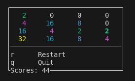

# 2048 Simple implementation
implementation of 2048 using ncurses in C.

- Currently tested on linux only
- Build with `chmod +x build.sh && ./build.sh`
- run with `./board`
- Make sure you have **ncurses** installed

